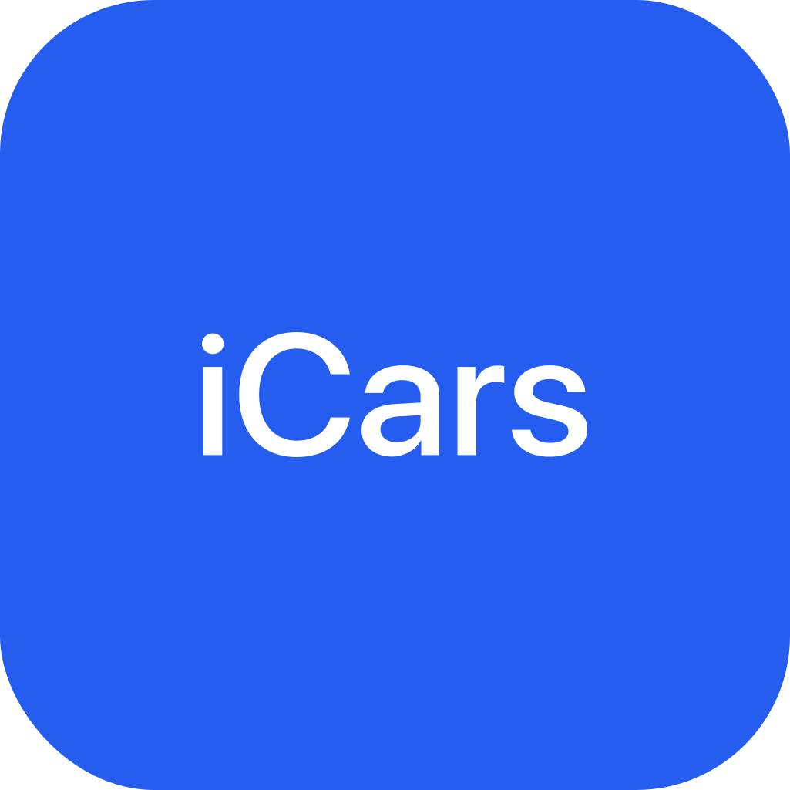
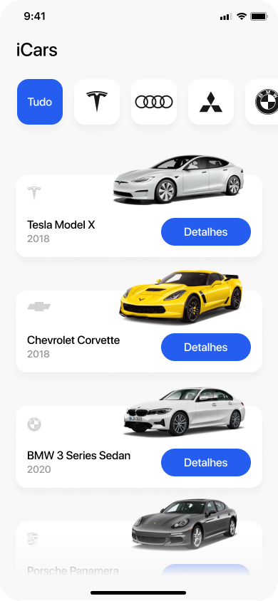

<p align="center">
  
</p>


<p align="center">
 <a href="https://www.figma.com/file/QkLVJwjXsbkFrbIrUwd6hL/iCars?node-id=5%3A2">
   
  </a>
  <a href="https://github.com/Th3Ang3lo/icars-api">
    
  </a>
  <a href="https://github.com/lucasaugustscode/todo/blob/main/LICENSE">
   
  </a>
</p>


<p align="center">
  iCars is an application with the objective of evaluating the selected car.
</p>

<p float="left" align="center" >
  
  
    
</p>

<br/>

## 🚘 How to run the project?

1 - First you need to clone the repository

```zsh
git clone https://github.com/lucasaugustscode/icars.git
```

2 - You will need to install the project's dependencies with the following command:

```zsh
yarn or npm install
```
**OBS:** You need to have [Node](https://nodejs.org/en/) installed.


3 - Now you need to go to the [API](https://github.com/Th3Ang3lo/icars-api) made by my friend from that little star and get the API link and create a **.env** file in the application's root directory. *(.env.example has the name of the environment variable)*

4 - As the project was created with [Expo](https://expo.dev/), just run the command:

```zsh
npx expo start --clear
```

*If you want to run on the CLI, it's also possible thanks to [Expo Bare workflow](https://docs.expo.dev/introduction/managed-vs-bare/).*

😉 Now just test the application and have fun with the app.

## 🔧 Technologies used in development
- [React Native](https://reactnative.dev/)
- [Expo](https://expo.dev/)
- [styled-components](https://styled-components.com/)
